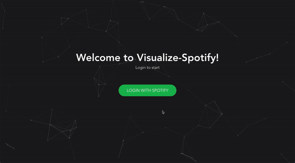

# VisualizeSpotify


Visualize-Spotify is a React web application that uses the Spotify Web API to visualize music preferences. It also provides a tinder-esque functionality that allows you to swipe through recommended songs and see in real-time its stats as well as how it affects your global music preferences via track analytics.

## Key features
  - Users will be able to login to the web application by authenticating their Spotify account.
  - Users will be able to view analytics providing insight into the type of music they enjoy listening to based on their liked songs playlist.
  - Users will be able to swipe through recommended songs and view the stats of that specific track.
  - Users will be able to filter and discover new songs based on the range of stats they provide.

## Where to find the project
Project is still in development.

## Current Demo/Example


## Licensing
Visualize-Spotify is licensed under the Apache-2.0 License as of 2020.

---

# User Documentation
## Getting Started
## Features and functionality
## Tutorials/Code Examples
## Existing Extensions and Integrations
None
## FAQ
To be determined
## Release Notes and Version Info
  - v0.2.0
    - v0.2.0 introduces a fully functioning landing screen with filtering, visualizations, and added user capabilities to swipe through songs and add them to their liked songs.
  - v0.1.0
    - v0.1.0 introduces a landing screen with Spotify authentication. Upon authentication, the user is redirected to a page where they can view the information of the song that they are currently playing.

---

# Developer Documentation
## Getting Started
Clone this repository and run `npm install` to install all the necessary dependencies.

Navigate to the client directory and launch the application in developer mode (this web application does not have a separate server).
```
$ cd client
$ npm start
```
The client will be running on http://localhost:3000


## Code Structure
The source code for Visualize-Spotify can be found in the src directory. This includes:
  - <strong>App.js</strong>: The main interface. Includes the context layer API as well as routing based on authentication status.
  - <strong>DataLayer, reducer</strong>: The data layer of the application that allows certain props to fetched from anywhere in the project structure.
  - <strong>spotify.js</strong>: The spotify configuration file for authentication. Includes the client ID, authorization scopes, and redirect URI that would return a token to the user. 
  - <strong>assets</strong>: A directory holding all SVG files.
  - <strong>components</strong>: A directory holding all the page components as well as their stylesheets. 
  - <strong>config</strong>: A directory that holds the config file for the react-particles background. 
  - <strong>tests</strong>: A directory holding the files for jest testing. 

Page components should be in `src/components` directory along with their CSS stylesheets.

## CI Documentation
Visualize-Spotify uses Travis-CI test builds. The configuration file can be found in the `.travis.yml` file. Before install, it navigates to the client folder and runs the following scripts:
  - <strong>yarn lint</strong>
    - This runs ESLint on the `client/src` directory.
  - <strong>yarn build</strong>
    - This creates a production build to ensure that it builds without error.
  - <strong>yarn test</strong>
    - Testing creates a code coverage report using Codecov in conjunction with running tests found in the `client/src/tests` directory. To update coverage reports in real-time, coverage tests are conducted by passing in a Codecov token as such: `./node_modules/.bin/codecov --token='73defb26-5b47-42ca-9b9c-62a9c2c47fda`. This can be found in the `package.json` file. 
    - Moreover, it ignores `src/ServiceWorker.js` and `src/index.js` because they are either not used or serve trivial purpose. The configuration file for this can be found in `client/jest.config.json`.
  - <strong>yarn doc</strong>
    - This updates the documentation using JSDoc3 by following the configuration file `jsdoc.config.json` found in the root directory. As can be found in `package.json`, the home page uses `README.md` found in the root directory. The documentation is hosted using GitHub Pages and can be found [here](https://jiyoonee.github.io/VisualizeSpotify/).

## Extensions and Integration authors
There are currently no extensions or integration authors.

## Release Notes and Roadmap
  - Version 0.2.0 has been released and includes a fully functioning landing page that hooks up with the Spotify Web API. It generates recommendations based on a <strong>combination of the user's top artists and tracks</strong> as well as filter ranges with regard to track analytics including <strong>danceability, acousticness, positivity, energy, and popularity</strong>. The interface includes a graph visualizing these five metrics for each track. Users also have the ability to swipe through these recommendations, either rejecting it and going on the next recommendation, or accepting it and adding it to their liked songs. </br>
  - Version 0.1.0 has been released and includes a landing page with authentication. Upon authentication, the application redirects to an interface where users can check the current song on play. The Spotify Web API has been hooked up. </br>
  - Next releases will focus on fetching track analytics and implementing the recommendation system.

## API Documentation
Visualize-Spotify uses the Spotify Web API, whose detailed documentation can be found [here](https://developer.spotify.com/documentation/web-api/). API Documentation for this application can be found in its [GitHub Pages](https://jiyoonee.github.io/VisualizeSpotify/).
